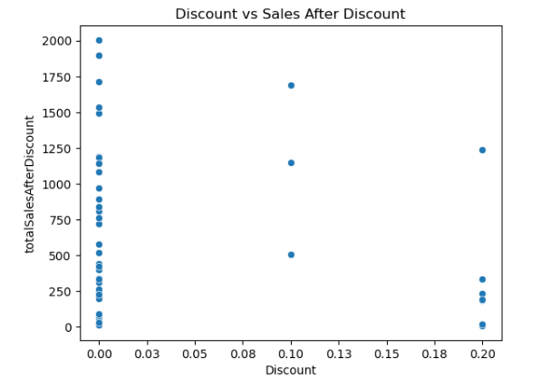
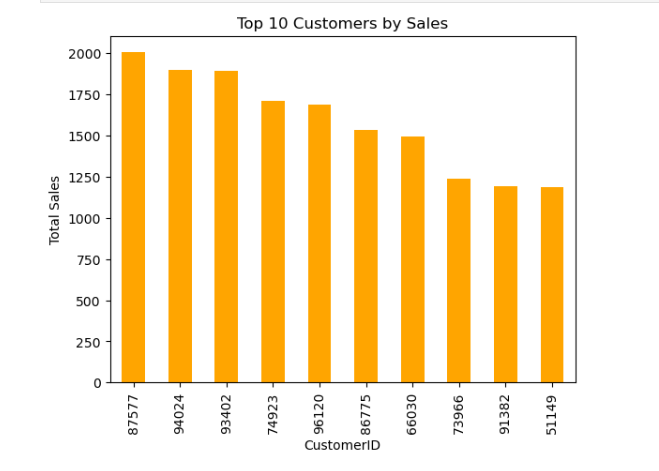
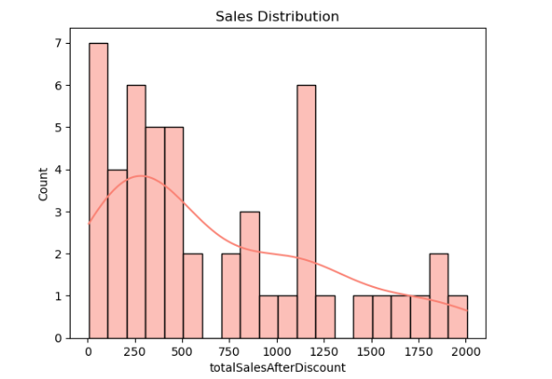
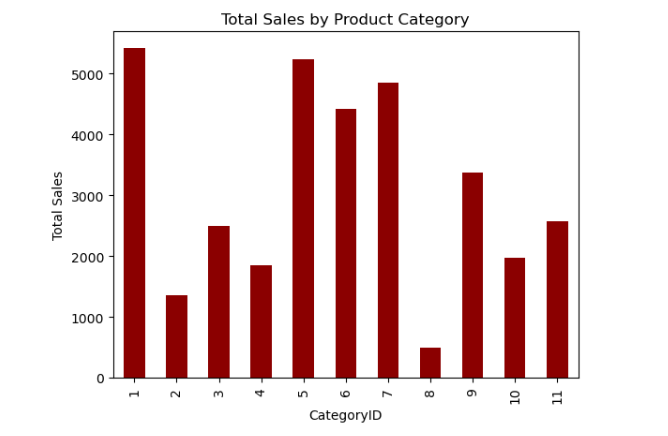
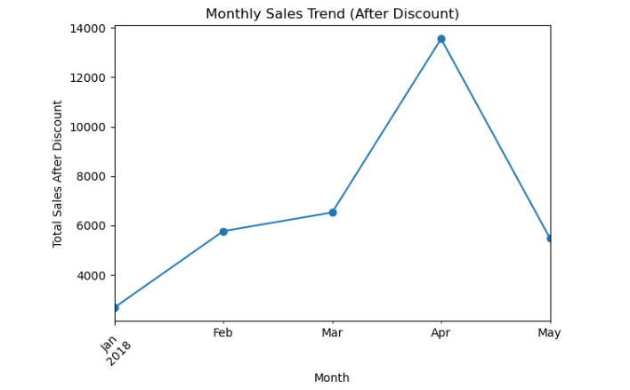

## 🏆 **Retail Hub Sales Analytics with SQL & Python**

📌 **Project Overview**

This project started as a *SQL capstone assignment* from a learning platform called *Learn With George* and was extended into a full *data analytics project* using both *SQL* and *Python*.

The goal of the project is to:

- Answer 10 business-related questions using *SQL*
- Clean and explore the data
- Move into *Python (Pandas, Matplotlib, Seaborn)* for deeper analysis and visualizations
- It focuses on analyzing sales, products, customers, and employee data to generate actionable business insights.
- Generate clear *insights, recommendations, limitations, and conclusion* for a sales scenario

##
🌐 **Data Source**

The dataset is provided by a learning platform: *Learn With George*.
It includes:
  - Sales table – transaction-level data (UnitPrice, Quantity, Discount, SalesDate, CustomerID, ProductID, etc.)
  - Products table – product information (ProductID, ProductName, CategoryID, UnitPrice, etc.)
  - Customers table – customer information (CustomerID, names, address, city, etc.)
  - Employees table – employee and city relationships
  - Categories table – product categories

The data was first explored and used in *MySQL Workbench, then exported and analyzed further in **Python*.

##
🛠 **Tools Used**

- *SQL (MySQL Workbench)* – for:
  - Data exploration
  - Aggregations
  - Joins, subqueries, CASE, CTEs, window functions
- *Python*
  - pandas – data loading, cleaning, transformation
  - matplotlib & seaborn – visualizations
- *Jupyter Notebook* – for analysis workflow and storytelling
- *VS Code* – for organizing files and writing README.md
- *Git & GitHub* – for version control and portfolio hosting.

##
📝 **Introduction**

The project explores and simulates a real-world retail or sales data to answer key business questions. The goal is to demonstrate data cleaning, SQL queries, Python analysis, and visualization skills where a company wants to:

- Understand *total sales performance*
- Identify *top products and customers*
- Analyze *discount behavior*
- See *sales trends over time*
- Classify sales into categories such as *High / Medium / Low*
- Use both *SQL skills* and *Python data analysis* to extract value from the data

Sustainable Development Goals (SDG) Relevance
This project demonstrates how sales and business analytics can contribute to the following SDGs:
- Identifies top-performing products and customers to improve business performance and economic activity.
- Uses SQL and data analytics to modernize decision-making processes and optimize operations.
- Helps businesses analyze trends to reduce waste, avoid overproduction, and optimize resource use.
- Sharing the project openly encourages collaboration and knowledge sharing in the data community.

The workflow:
1. Start in *SQL* to answer the capstone questions and compute core metrics.
2. Export cleaned tables (e.g. sales_cleaned.csv, products.csv, customers.csv).
3. Continue in *Python* for:
   - Feature creation (e.g. totalSalesAfterDiscount)
   - Visualizations
   - Insights and conclusions.

##
📂 **Loading Dataset**

In the Jupyter notebook (notebooks/analysis.ipynb), the datasets are loaded using pandas:
```python
import pandas as pd

sales = pd.read_csv('data/sales.csv')
customers = pd.read_csv('data/customers.csv')
products = pd.read_csv('data/products.csv')
```

##
🧹 **Data Cleaning Steps**

**SQL:**
   - Checked for missing values and duplicates using queries.
   - Added calculated columns:
     - totalSalesBeforeDiscount = UnitPrice * Quantity
     - totalSalesAfterDiscount = UnitPrice * Quantity * (1 - Discount)
   - Joined Sales with Products, Customers, and Categories where IDs matched.
   - Treated mismatched IDs as real-world data quality issues.

**Python:**
- Checked missing values:
```python
       print("\nMISSING VALUE RESULT")
       print(sales.isnull().sum())
```
- Checked duplicates:
```python
       print("\nDUPLICATES RESULT")
       print(sales.duplicated().sum())
```
- Basic stats:
```python
       print("\nDATASET INFO:")
       print(sales.describe(include='all'))
```
- Created calculated columns:
```python
       sales['totalSalesBeforeDiscount'] = sales['UnitPrice'] * sales['Quantity']
       sales['totalSalesAfterDiscount'] = sales['UnitPrice'] * sales['Quantity'] * (1 - sales['Discount'])
```
During the SQL phase, some ID mismatches were discovered between Sales and Customers / Products (different ID ranges). These were treated as real-life data quality issues and documented as limitations.

##
🔍 **Exploratory Data Analysis**

**🔹 SQL Questions (Capstone Tasks)**

The following SQL questions were answered using MySQL Workbench:
1.	What is the total sales amount?
	- Using aggregates (e.g. SUM(UnitPrice * Quantity * (1 - Discount))).
2.	Which product has the highest total sales amount?
	- Using GROUP BY ProductID and ORDER BY totalSalesAfterDiscount DESC.
3.	What is the name of the top customer and their address who purchased the most?
	- Combining Sales and Customers using joins and aggregation.
4.	Show all the employee names and the cities they live in.
	- Joining Employees with a Cities table (via CityID) and concatenating name fields.
5.	What are the average sales purchased per customer?
	- Grouping by CustomerID and averaging total sales value.
6.	Show all the ProductName and what categories they belong to.
	- Joining Products with Categories on CategoryID.
7.	Classify the totalSalesAfterDiscount column as High, Medium, or Low sales
	- Using a CASE statement to categorize sales values.
8.	Display each product’s sales information — including ProductID, ProductName, and totalSalesAfterDiscount — along with a row number ordered by total sales (after discount)
	- Using a CTE and ROW_NUMBER() window function.
9.	Find the average discount given for each product
	- Using AVG(Discount) grouped by ProductID.
10.	List the products that are greater than the average price using a subquery.
	- Comparing each product’s price to the overall average using a subquery.

These SQL results were then exported and used as the basis for deeper Python analysis and visualizations.

**🔹 Python EDA Focus**

In Python, the main analysis covered:
1.	Total Sales (After Discount)
	- Summed totalSalesAfterDiscount across the whole dataset.
2.	Top Products by Sales
	- Grouped by ProductID and merged with Products to show names.
3.	Top Customers by Sales
	- Grouped by CustomerID and (where possible) linked with customer details.
4.	Average Sales per Customer
	- Calculated means across customers.
5.	Sales Distribution
	- Used histograms to understand how total sales are distributed, especially high vs low sales.
6.	Discount vs Sales Relationship
	- Used scatter plots to check if higher discounts corresponded to higher or lower sales.
7.	Monthly Sales Trend & Anomaly Detection
	- Converted SalesDate to monthly periods and summed sales per month.
	- Used mean and standard deviation to check for unusually high/low months.

##
📈 **Visualizations** **&**  📊 **Insights**

All visualizations were created in Python using matplotlib and seaborn.Based on both SQL and Python analysis:

**1.	Discount usage is low and unstructured**
- Most sales occur at 0% discount, with only a few transactions at 10% and 20% discount levels.
- There is no clear evidence that higher discounts consistently drive much higher sales.

1️⃣ Discount vs Sales After Discount (Scatter Plot)



**2.	A few products drive a significant share of sales**
- In the top 10 products, ProductID 369 has the highest total sales (~2000), while products like 2 and 147 have lower totals (~1250).

2️⃣ Top 10 Products by Sales (Bar Chart)


**3.	High-value customers exist and matter**
- CustomerID 87577 is a high-value customer with total sales around 2000, while others in the top 10 generate lower totals (~1250).

3️⃣ Top 10 Customers by Sales (Bar Chart)



**4.	Sales distribution shows many small/zero-value transactions**
- The histogram shows a large number of transactions with totalSalesAfterDiscount around 0, and only a few high-value values (950–2000).

4️⃣ Sales Distribution (Histogram)



**5.	Category 1 is a strong revenue driver**
- CategoryID 1 has the highest total sales (~5500), while some categories (e.g., Category 8) lag behind (~500).

5️⃣ Total Sales by Product Category (Bar Chart)



**6.	Sales trend increases early in the year and peaks in April**
- Monthly sales after discount rise from January to April, with April being the strongest month (~14,000), followed by a decline in May.

6️⃣ Monthly Sales Trend (Line Chart)



**7.	No extreme anomalies detected**
- Using a 2-standard-deviation rule on monthly sales, no month was flagged as a strong anomaly, though April is notably higher than others.

## 
✅ **Recommendations**

1.	Focus on high-performing products and categories
    - Double down on ProductID 369 and CategoryID 1 with focused marketing and inventory strategies.
2.	Investigate and support weaker products/categories
    - Review low-performing products (e.g., ProductID 2, 147) and low-sales categories, and consider promotions, bundles, or repositioning.
3.	Segment and reward top customers
    - Treat high-value customers (e.g., customer 87577) as VIPs with targeted offers, loyalty programs, or personalized follow-ups.
4.	Use discounts strategically, not randomly
    - Since most sales occur without discounts, experiment with planned discount campaigns, especially in low months like January, and measure the impact.
5.	Plan around seasonal patterns
    - Prepare for higher sales in April-like months with stock and staffing plans, while using slower months for experiments and process improvements.
6.	Monitor large orders separately
    - Since large transactions are rare but impactful, track them closely and maintain high service levels for these orders.

##
⚠ **Limitations**

1.	Short time range
    - The monthly trend and anomaly detection are based on a limited time period (e.g., January–May 2018), which is not enough to fully understand long-term seasonality.
2.	ID mismatches between tables
    - Some CustomerIDs and ProductIDs in the Sales table did not match the ranges in the Customers and Products tables, limiting the accuracy of some joins.
3.	Lack of cost and profit data
    - The analysis is based on sales amounts only. Profitability cannot be evaluated without cost data.
4.	Aggregated view hides details
    - Focusing on top 10 products/customers and monthly totals hides more granular behavior at the transaction level.
5.	Simple treatment of discounts
    - Discounts are treated as simple percent reductions and not modeled in detail (no causal analysis or advanced pricing optimization).

##
🧾 **Conclusion**

This project demonstrates how to start with raw relational data in SQL, answer structured business questions, and then extend the work into Python for:
- Additional feature engineering (e.g., totalSalesBefore/AfterDiscount)
- Visualizations (scatter plots, bar charts, histograms, line charts)
- Trend and anomaly detection
- Insight and recommendation generation

It showcases practical skills in:
- SQL (joins, aggregates, CASE, CTEs, window functions, subqueries)
- Python (Pandas for data manipulation, Matplotlib/Seaborn for visualizations)
- Data cleaning, EDA, and business interpretation

With more complete and longer-term data (including profit, customer demographics, and clean IDs), this analysis could be extended into predictive modeling, customer segmentation, and advanced pricing strategies.

##
📌 **Project Status**

✅ Initial SQL capstone questions completed

✅ Python notebook created with data cleaning, EDA, and visualizations

✅ Insights, recommendations, limitations, and conclusion documented

🔄 Future work:
   - Add more advanced models (e.g., forecasting, regression)
   - Improve data quality (fix ID mismatches)
   - Add profit and cost analysis

##